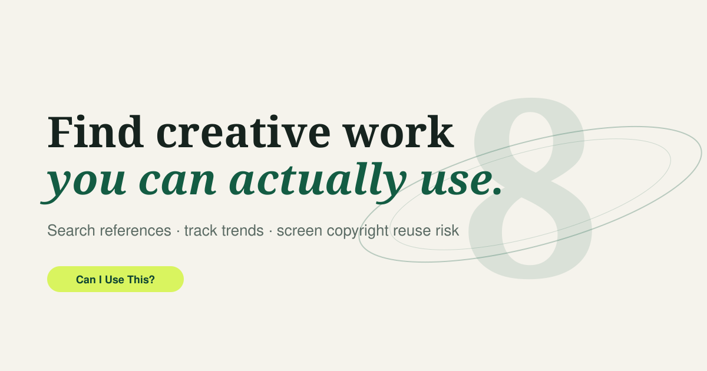

<div align="center">


# Can I Use This?

**Find creative work you can actually use.**

A creative content discovery and copyright reuse platform — search references, watch format
trends, browse music by usage rights, and screen a source for reuse risk before you publish.

`Interactive frontend prototype` · `No build step` · `No dependencies` · `No tracking`

**[→ View the live site](https://thisishemantsingh.github.io/can-i-use-this/)**



</div>

---

> [!IMPORTANT]
> **This is an educational prototype, not legal advice.** It provides simplified, rule-based
> information and risk indicators only. It does not guarantee that any reuse is lawful and it does
> not replace consultation with a qualified copyright lawyer. All search results, trend metrics and
> music metadata in this repository are illustrative sample data.

## Why this exists

Creative teams find a reference in seconds and then spend days working out whether they are allowed
to use it. The rights question usually arrives last — after the deck is built and the edit is
locked. "Can I Use This?" puts it first: every result carries its licence and reuse signal on the
surface, and the Rights Checker turns eight plain questions into a risk read, a list of what may
actually be reusable, and the law that applies where you publish.

## Features

| Page | What it does |
| --- | --- |
| **Search** | Full-text search across sample creative references with quick category chips (images, video, music, campaigns, free to reuse) and advanced filters for content type, licence, platform and reuse status. Each result shows title, category, style description, licence status and reuse signal. |
| **Trending** | Creative formats gaining momentum across design, social, film and audio — with search growth, usage growth, mentions and saves, plus a note on how safely each *look* can be borrowed. |
| **Music** | Tracks browsable by mood and style, with the licence type surfaced on every row (Commercially Licensed, CC BY, CC0, Permission Required) and prototype play-state controls. |
| **Rights Checker** | Eight-input, rule-based screening returning a lower / medium / high risk signal, what may be reusable, actions required before publishing, and a link to the governing statute for your jurisdiction. |

Also included: hash-based routing, responsive layout down to 360px, keyboard-accessible controls,
`prefers-reduced-motion` support, a print stylesheet, and Open Graph metadata.

## Quick start

No toolchain, no install. Clone and open:

```bash
git clone https://github.com/thisishemantsingh/can-i-use-this.git
cd can-i-use-this
open index.html          # macOS — or just double-click the file
```

Some browsers restrict `file://` behaviour, so a local static server is recommended:

```bash
python3 -m http.server 8080
# or
npx serve .
```

Then visit <http://localhost:8080>.

## Deploying to GitHub Pages

The workflow at [`.github/workflows/pages.yml`](.github/workflows/pages.yml) publishes the site on
every push to `main`. It passes `enablement: true`, so it turns Pages on itself the first time it
runs — you do not need to touch **Settings → Pages** manually.

This copy is live at **<https://thisishemantsingh.github.io/can-i-use-this/>**.

Two things worth knowing if you fork it:

- GitHub Pages requires a **public** repository on the Free plan. On a private repo the deploy fails
  with `Your current plan does not support GitHub Pages for this repository`; that needs GitHub Pro
  or a static host like Netlify or Cloudflare Pages instead.
- All asset paths are relative, so the site works from a subdirectory without configuration.

## Project structure

```
.
├── index.html              # All four pages as sections, switched by the hash router
├── assets/
│   ├── css/styles.css      # Design tokens, components, responsive + print rules
│   ├── js/data.js          # Prototype dataset: works, trends, tracks, legal sources
│   ├── js/app.js           # Router, search, filters, player state, scoring engine
│   └── img/                # favicon + Open Graph cover (SVG)
├── .github/workflows/      # GitHub Pages deployment
├── CONTRIBUTING.md
├── LICENSE
└── README.md
```

## Design system

| Token | Value | Use |
| --- | --- | --- |
| `--primary` | `#135C43` | Brand green, primary actions, links |
| `--background` | `#F5F3EC` | Page background |
| `--surface` | `#FFFEFA` | Cards, panels, inputs |
| `--accent` | `#D9F45F` | Highlights, free-to-reuse signals |
| `--warning` | `#F3BF57` | Medium-risk / limited-reuse signals |
| `--danger` | `#A83C35` | High-risk / permission-required signals |
| `--text` | `#16231E` | Body text |

Type is set in **Fraunces** (editorial display), **Inter** (interface) and **JetBrains Mono**
(metadata). The hero's background element is a large translucent `8` rendered as a planet, with an
elliptical orbital ring clipped into front and back halves so it passes behind and in front of the
glyph.

## How the Rights Checker scores

The engine in [`assets/js/app.js`](assets/js/app.js) is intentionally small and readable — the point
is that a user can audit it. It takes eight inputs (source, jurisdiction, content type, licence,
purpose, amount reused, transformative context, attribution), starts from a baseline, and adjusts:

The first question it asks is whether the stated permission actually **covers** the stated use:

- CC0 and a purchased licence always cover it.
- CC BY covers it **only if attribution is on** — credit is the licence's single condition, so
  planning to skip it turns a licensed use into a breach.
- CC BY-NC covers it **only if attribution is on and the purpose is not commercial**.
- "Unknown" and "all rights reserved" never cover it.

A covered use scores low, and what remains is diligence risk — verifying the licence is genuine,
plus a nudge for commercial use and for media where rights stack. An uncovered use has to survive a
statutory exception instead, so every factor is weighed:

- **Purpose** — commercial use raises the score; education, criticism and review lower it.
- **Amount reused** — scales with how much of the work you take.
- **Content type** — adds risk where rights stack; music carries both master and publishing rights.
- **Transformative context** and **attribution** — lower the score where an exception is in play.
- **Jurisdiction** — India's Section 52 is a closed list, US fair use rewards transformative use, EU
  exceptions vary by member state, and multi-territory publishing is treated as the strictest
  applicable regime.

The result is banded into **lower** (`< 34`), **medium** (`< 67`) and **high** risk. The engine never
returns "cleared" — a low signal is a prompt to verify, not a clearance.

## Jurisdictions and legal sources

| Jurisdiction | Law | Provision | Official source |
| --- | --- | --- | --- |
| India | Copyright Act, 1957 | Section 52 — acts not constituting infringement | [copyright.gov.in](https://copyright.gov.in/Copyright_Act_1957/chapter_xi.html) |
| United States | Copyright Act | Section 107 — fair use | [copyright.gov/fair-use](https://www.copyright.gov/fair-use/) |
| United Kingdom | Copyright, Designs and Patents Act 1988 | Exceptions to copyright | [gov.uk guidance](https://www.gov.uk/guidance/exceptions-to-copyright) |
| European Union | Directive 2001/29/EC (InfoSoc) | Article 5 — exceptions and limitations | [EUR-Lex](https://eur-lex.europa.eu/eli/dir/2001/29/oj) |
| Other / multiple | Berne Convention framework + national law | Territory-by-territory | [WIPO](https://www.wipo.int/treaties/en/ip/berne/) |

## What is real, and what is not

**Working in this prototype**

- Responsive interface and page navigation
- Creative search, quick chips and advanced filtering
- Trending category filtering
- Music play-state controls
- Copyright risk calculation
- Jurisdiction-specific legal references

**Prototype only — do not rely on**

- The creative search database (sample records, not a live index)
- Trending statistics (illustrative values, not measured analytics)
- The music catalogue (no audio files are bundled)
- Licence verification and ownership verification (none is performed)
- Automatic URL analysis (the source field is never fetched or parsed)

## Path to production

- [ ] Backend with a searchable content database
- [ ] Integration with verified creative-content APIs
- [ ] Music streaming or preview API
- [ ] Automated licence metadata validation
- [ ] Original creator and ownership verification
- [ ] Real trend analytics pipeline
- [ ] Legal review of the rule set for each supported jurisdiction
- [ ] Terms of service and privacy policy
- [ ] User accounts and saved searches
- [ ] Content moderation and reporting system

## Privacy

The site is fully static. Nothing typed into the search bar or the Rights Checker is transmitted,
stored or logged — the assessment runs in the browser. The only external requests are to Google
Fonts for the three typefaces; self-host `assets/` fonts if you need zero third-party calls.

## Contributing

Issues and pull requests are welcome — see [CONTRIBUTING.md](CONTRIBUTING.md). Corrections to the
legal summaries are especially valuable; please cite the statute or official guidance you are
relying on.

## Licence

Source code is released under the [MIT Licence](LICENSE). The sample dataset in
`assets/js/data.js` is fictional and provided for demonstration only.
